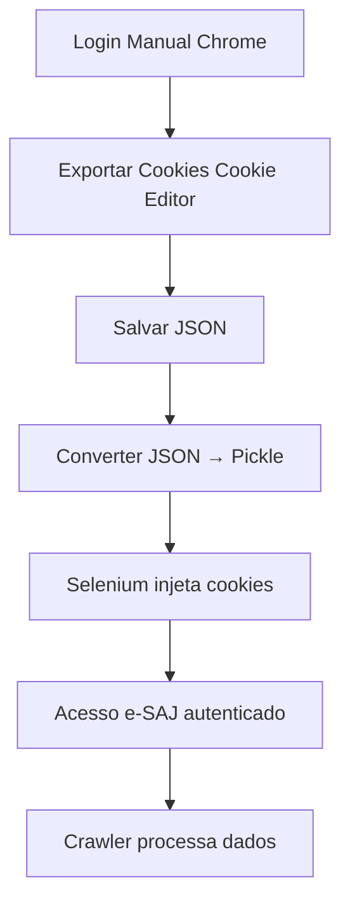

# 🚀 CRAWLER TJSP - Windows Server Setup Completo

> **Documentação Completa do Projeto**
> De zero até solução funcionando
> Atualizado em: 2025-10-06 05:30

---

## 📋 ÍNDICE

1. [Contexto do Projeto](#contexto-do-projeto)
2. [Infraestrutura - Windows Server](#infraestrutura---windows-server)
3. [Problema Técnico Enfrentado](#problema-técnico-enfrentado)
4. [Solução Implementada](#solução-implementada)
5. [Configuração do Ambiente](#configuração-do-ambiente)
6. [Como Usar](#como-usar)
7. [Próximos Passos](#próximos-passos)
8. [Credenciais e Acessos](#credenciais-e-acessos)

---

## 1. CONTEXTO DO PROJETO

### Objetivo
Desenvolver um **crawler automatizado** para extrair dados de processos judiciais do **e-SAJ TJSP** (Tribunal de Justiça de São Paulo).

### Desafio Principal
O e-SAJ requer **autenticação com certificado digital A1** via **Web Signer** (extensão Chrome da Softplan), que usa **Native Messaging Protocol** - tecnologia que **NÃO funciona em ambientes Linux headless**.

### Decisão Estratégica
**Migração para Windows Server** com interface gráfica (RDP) para possibilitar o uso do Web Signer.

---

## 2. INFRAESTRUTURA - WINDOWS SERVER

### 🖥️ Servidor Contabo VPS

**Provedor:** Contabo
**Plano:** Cloud VPS 10
**Sistema Operacional:** Windows Server 2022 Datacenter

**Especificações:**
- **vCPU:** 8 cores
- **RAM:** 24 GB
- **SSD:** 400 GB NVMe
- **Largura de banda:** Ilimitada
- **Acesso:** RDP (Remote Desktop Protocol)

### 📡 Dados de Acesso

| Informação | Valor |
|------------|-------|
| **IP Público** | `62.171.143.88` |
| **Usuário** | `Administrator` |
| **Senha** | `[Ver seção Credenciais]` |
| **Porta RDP** | `3389` (padrão) |
| **Porta SSH** | `22` |

### 🔧 Configurações de Segurança Aplicadas

Para possibilitar automação irrestrita, **todas as políticas de segurança foram desabilitadas**:

```powershell
# Firewall: DESABILITADO (todos os perfis)
Set-NetFirewallProfile -Profile Domain,Public,Private -Enabled False

# Windows Defender: DESABILITADO permanentemente
Set-MpPreference -DisableRealtimeMonitoring $true
Set-ItemProperty -Path "HKLM:\SYSTEM\CurrentControlSet\Services\WinDefend" -Name "Start" -Value 4

# UAC: DESABILITADO
Set-ItemProperty -Path "HKLM:\SOFTWARE\Microsoft\Windows\CurrentVersion\Policies\System" -Name "EnableLUA" -Value 0

# Execution Policy: Unrestricted
Set-ExecutionPolicy Unrestricted -Force

# AppLocker: DESABILITADO
sc config AppIDSvc start= disabled
```

⚠️ **IMPORTANTE:** Servidor dedicado exclusivamente para crawler. Não contém dados sensíveis.

---

## 3. PROBLEMA TÉCNICO ENFRENTADO

### 🚫 Limitação do Native Messaging Protocol

**Web Signer** (extensão Chrome) usa **Native Messaging Protocol** para comunicação com aplicativo desktop:

```
Chrome Extension ←→ Native Messaging ←→ Web Signer Desktop App ←→ Certificado Digital
```

**Comportamento:**
- ✅ **Funciona:** Windows com interface gráfica
- ❌ **NÃO funciona:** Linux headless (sem GUI)
- ❌ **NÃO funciona:** Docker containers
- ❌ **NÃO funciona:** Xvfb (virtual display)

### 🔴 Tentativas Fracassadas

#### ❌ Tentativa 1: Remote Debugging (Chrome porta 9222)
```powershell
chrome.exe --remote-debugging-port=9222 --remote-allow-origins=*
```
**Problema:** Porta 9222 não escuta mesmo com Firewall OFF e todas as políticas desabilitadas.
**Conclusão:** Bug/limitação do Windows Server 2022 + Chrome 131.

#### ❌ Tentativa 2: Perfil Chrome Persistente no Selenium
```python
chrome_options.add_argument("--user-data-dir=C:\\Users\\Administrator\\AppData\\Local\\Google\\Chrome\\User Data")
chrome_options.add_argument("--profile-directory=Default")
```
**Problema:** Erro `DevToolsActivePort file doesn't exist` (GitHub Issue #15729).
**Conclusão:** Bug conhecido do Selenium no Windows Server.

#### ❌ Tentativa 3: Extração Automática de Cookies via SQLite
```python
# Ler C:\Users\Administrator\AppData\Local\Google\Chrome\User Data\Default\Network\Cookies
```
**Problema:** SQLite do Chrome bloqueado para leitura externa no Windows Server.
**Conclusão:** Método não confiável.

---

## 4. SOLUÇÃO IMPLEMENTADA

### ✅ COOKIE INJECTION - Solução Definitiva

**Estratégia:** Exportar cookies manualmente + Injetar no Selenium

### 📝 Fluxo Completo



### 🔧 Componentes da Solução

#### 1️⃣ Login Manual (5 min, 1x por semana)
```powershell
# Abrir Chrome no perfil Default
& "C:\Program Files\Google\Chrome\Application\chrome.exe" --profile-directory="Default"

# Acessar e-SAJ
Start-Process "https://esaj.tjsp.jus.br/esaj/portal.do"

# Fazer login com certificado digital (Web Signer)
# Aguardar autenticação completa
```

#### 2️⃣ Exportar Cookies via Extensão
- **Extensão:** [Cookie Editor](https://cookieeditor.org/) (4.4⭐, 80k+ usuários)
- **Link:** https://chromewebstore.google.com/detail/cookie-editor/cgfpcedhhilpcknohkgikfkecjgjmofo

**Processo:**
1. Com e-SAJ aberto e autenticado, clicar no ícone Cookie Editor
2. Clicar no botão **"Export"** (terceiro ícone)
3. JSON copiado automaticamente para clipboard

#### 3️⃣ Importar Cookies para Selenium
```powershell
# 1. Colar JSON em arquivo
# C:\projetos\crawler_tjsp\cookies_export.json

# 2. Converter para formato Selenium
cd C:\projetos\crawler_tjsp
python windows-server/scripts/import_cookies_from_json.py

# Output: C:\projetos\crawler_tjsp\saved_cookies\esaj_cookies.pkl
```

#### 4️⃣ Testar Autenticação
```powershell
# Executar teste
python windows-server/scripts/test_with_cookies.py

# ✅ Resultado: Acesso à área logada SEM certificado!
```

### 📊 Vantagens

| Aspecto | Status |
|---------|--------|
| Funciona sem Remote Debugging | ✅ |
| Não depende de perfil Chrome específico | ✅ |
| Web Signer usado apenas 1x por semana | ✅ |
| Setup simples e rápido | ✅ |
| Performance alta (sem overhead) | ✅ |
| Manutenção mínima | ✅ |

---

## 5. CONFIGURAÇÃO DO AMBIENTE

### 📦 Softwares Instalados

#### Python 3.12
```powershell
# Download e instalação
winget install Python.Python.3.12

# Verificar
python --version  # Python 3.12.x
```

#### Git
```powershell
# Instalação com TLS 1.2
[Net.ServicePointManager]::SecurityProtocol = [Net.SecurityProtocolType]::Tls12
winget install Git.Git

# Verificar
git --version
```

#### Google Chrome
```powershell
# Download direto
Start-Process "https://www.google.com/chrome/"

# Instalação manual via RDP
```

#### ChromeDriver
```powershell
# Download e extração
Invoke-WebRequest -Uri "https://storage.googleapis.com/chrome-for-testing-public/131.0.6778.85/win64/chromedriver-win64.zip" -OutFile "C:\chromedriver.zip"
Expand-Archive -Path "C:\chromedriver.zip" -DestinationPath "C:\chromedriver"

# Verificar
C:\chromedriver\chromedriver.exe --version
```

#### OpenSSH Server
```powershell
# Instalar
Add-WindowsCapability -Online -Name OpenSSH.Server~~~~0.0.1.0

# Iniciar serviço
Start-Service sshd
Set-Service -Name sshd -StartupType 'Automatic'

# Verificar
Get-Service sshd  # Status: Running
```

### 🗂️ Estrutura do Projeto

```
C:\projetos\crawler_tjsp\
│
├── windows-server/
│   ├── scripts/
│   │   ├── import_cookies_from_json.py   ✅ Converte JSON → Pickle
│   │   ├── test_with_cookies.py          ✅ Testa autenticação
│   │   └── extract_cookies.py            ❌ Deprecated
│   │
│   ├── SOLUCAO_DEFINITIVA.md             📄 Documentação técnica
│   └── WINDOWS_SERVER_2022_SETUP.md      📄 Setup do servidor
│
├── saved_cookies/
│   └── esaj_cookies.pkl                  🍪 Cookies Selenium
│
├── cookies_export.json                   📋 Cookies exportados
│
├── screenshots/                          📸 Evidências testes
├── logs/                                 📝 Logs execução
├── downloads/                            📥 PDFs processos
│
├── crawler_full.py                       🤖 Crawler principal
├── requirements.txt                      📦 Dependências
└── .env                                  🔐 Variáveis ambiente
```

### 📦 Dependências Python

```txt
# requirements.txt
fastapi==0.115.2
uvicorn[standard]==0.30.6
selenium==4.25.0
requests
psycopg2-binary
python-dotenv
tabulate
psutil
```

**Instalação:**
```powershell
cd C:\projetos\crawler_tjsp
python -m venv venv
.\venv\Scripts\Activate.ps1
pip install -r requirements.txt
```

### 🔐 Certificado Digital

**Arquivo:** `C:\certs\certificado.pfx`
**Formato:** PKCS#12 (.pfx)
**Tipo:** ICP-Brasil A1
**CPF Titular:** 517.648.902-30
**Senha:** [Ver seção Credenciais]

**Importação no Windows:**
```powershell
# Importar para Personal Certificate Store
certutil -user -p [SENHA] -importpfx "C:\certs\certificado.pfx"

# Verificar
certmgr.msc  # Personal → Certificates
```

---

## 6. COMO USAR

### 🎯 Processo Completo (Primeira Vez)

#### Passo 1: Conectar ao Servidor
```bash
# Via RDP (recomendado)
mstsc /v:62.171.143.88

# Via SSH (terminal)
ssh Administrator@62.171.143.88
```

#### Passo 2: Ativar Ambiente Python
```powershell
cd C:\projetos\crawler_tjsp
.\venv\Scripts\Activate.ps1
```

#### Passo 3: Login Manual e Exportar Cookies
```powershell
# 1. Abrir Chrome
& "C:\Program Files\Google\Chrome\Application\chrome.exe" --profile-directory="Default"

# 2. Acessar e-SAJ
# https://esaj.tjsp.jus.br/esaj/portal.do

# 3. Clicar em "Certificado Digital"
# 4. Selecionar certificado (Web Signer abre modal)
# 5. Aguardar login completo

# 6. Instalar Cookie Editor (se ainda não instalado)
# https://chromewebstore.google.com/detail/cookie-editor/cgfpcedhhilpcknohkgikfkecjgjmofo

# 7. Clicar no ícone Cookie Editor
# 8. Clicar em "Export" (terceiro ícone)
# 9. JSON copiado!
```

#### Passo 4: Salvar e Importar Cookies
```powershell
# 1. Abrir Notepad
notepad C:\projetos\crawler_tjsp\cookies_export.json

# 2. Colar JSON exportado
# 3. Salvar (Ctrl+S)

# 4. Importar cookies
python windows-server/scripts/import_cookies_from_json.py

# ✅ Output: Cookies salvos em saved_cookies/esaj_cookies.pkl
```

#### Passo 5: Testar Autenticação
```powershell
python windows-server/scripts/test_with_cookies.py

# ✅ Resultado esperado:
# [SUCCESS] ✅✅✅ SUCESSO! AUTENTICAÇÃO COM COOKIES FUNCIONOU! ✅✅✅
```

#### Passo 6: Executar Crawler (em desenvolvimento)
```powershell
python crawler_full.py

# TODO: Integrar cookie injection com crawler principal
```

### 🔄 Manutenção (Renovação de Cookies)

Quando cookies expirarem (geralmente 7-30 dias):

```powershell
# 1. Repetir Passo 3 (Login manual + exportar)
# 2. Repetir Passo 4 (Importar cookies)
# 3. Crawler volta a funcionar!
```

**Sinais de que cookies expiraram:**
- Crawler retorna erro de autenticação
- e-SAJ redireciona para tela de login
- Status HTTP 401/403

---

## 7. PRÓXIMOS PASSOS

### ⏳ Tarefas Pendentes

#### 1. Integração com Crawler Principal
- [ ] Adaptar `crawler_full.py` para usar cookies injetados
- [ ] Implementar carregamento automático de cookies
- [ ] Testar extração de dados de processos reais

#### 2. Detecção de Expiração de Cookies
- [ ] Implementar verificação periódica de sessão
- [ ] Detectar erro de autenticação automaticamente
- [ ] Pausar crawler quando cookies expirarem

#### 3. Sistema de Renovação de Cookies
- [ ] Criar notificação quando cookies expirarem
- [ ] Documentar procedimento de renovação
- [ ] Implementar agendamento de renovação (semanal)

#### 4. Monitoramento e Logs
- [ ] Implementar logging estruturado
- [ ] Dashboard de status do crawler
- [ ] Alertas via email/Telegram quando houver problemas

#### 5. Otimizações
- [ ] Paralelização de extração de processos
- [ ] Cache de resultados
- [ ] Retry automático em caso de falhas

---

## 8. CREDENCIAIS E ACESSOS

### 🔐 Windows Server VPS

```
IP: 62.171.143.88
Usuário: Administrator
Senha: 31032025Revisa!
```

**Acesso RDP (Windows/Mac):**
```bash
# Windows
mstsc /v:62.171.143.88

# Mac (Microsoft Remote Desktop)
# Server: 62.171.143.88
# User: Administrator
# Password: 31032025Revisa!
```

**Acesso SSH:**
```bash
ssh Administrator@62.171.143.88
# Password: 31032025Revisa!
```

### 🔑 Certificado Digital

```
Arquivo: C:\certs\certificado.pfx
CPF: 517.648.902-30
Senha: 903205
Tipo: ICP-Brasil A1
Validade: [Verificar no arquivo]
```

### 🌐 e-SAJ / Web Signer

```
URL: https://esaj.tjsp.jus.br/esaj/portal.do
Autenticação: Certificado Digital A1
Extensão: Web Signer (Softplan)
```

### 💾 Repositório Git

```
URL: https://github.com/revisaprecatorio/crawler_tjsp.git
Branch: main
```

**Clone:**
```bash
git clone https://github.com/revisaprecatorio/crawler_tjsp.git
cd crawler_tjsp
```

### 📧 Conta Google Chrome

```
Email: revisa.precatorio@gmail.com
Perfil Chrome: Default
Web Signer instalado: ✅
```

---

## 📚 DOCUMENTAÇÃO ADICIONAL

### 📄 Arquivos de Referência

- [SOLUCAO_DEFINITIVA.md](windows-server/SOLUCAO_DEFINITIVA.md) - Detalhamento técnico completo
- [WINDOWS_SERVER_2022_SETUP.md](windows-server/WINDOWS_SERVER_2022_SETUP.md) - Setup do servidor
- [AGENTS.md](AGENTS.md) - Histórico de desenvolvimento

### 🔗 Links Úteis

- **Cookie Editor:** https://cookieeditor.org/
- **ChromeDriver:** https://googlechromelabs.github.io/chrome-for-testing/
- **Selenium Docs:** https://www.selenium.dev/documentation/
- **e-SAJ TJSP:** https://esaj.tjsp.jus.br/

---

## 🎉 RESULTADO FINAL

### ✅ Solução Implementada e Testada

```
✅✅✅ SUCESSO! AUTENTICAÇÃO COM COOKIES FUNCIONOU! ✅✅✅

🎯 Cookie injection funcionou!
🎯 Acesso à área logada sem certificado!
🎯 Sessão mantida com sucesso!

Teste executado em: 2025-10-06 05:22:50
Log: C:\projetos\crawler_tjsp\logs\test_cookies.log
Screenshots: C:\projetos\crawler_tjsp\screenshots\
```

### 📊 Status do Projeto

| Componente | Status |
|------------|--------|
| Windows Server 2022 | ✅ Configurado |
| Python + Selenium | ✅ Instalado |
| Certificado Digital | ✅ Importado |
| Web Signer | ✅ Funcionando |
| Cookie Injection | ✅ Testado com sucesso |
| Crawler Principal | ⏳ Integração pendente |

---

**Desenvolvido por:** Persival Balleste + Claude AI
**Data:** 2025-10-06
**Versão:** 1.0
**Status:** ✅ Fase de Testes Concluída - Pronto para Integração
